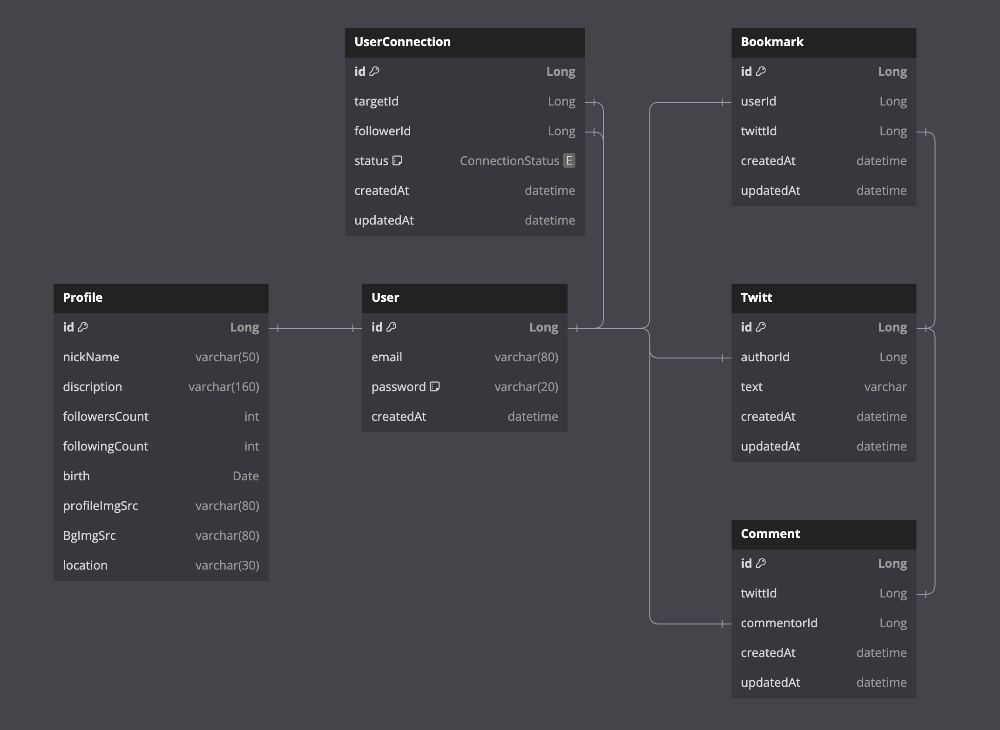

# Udemy BE time-attack XX

## 배경

당신은 신생 스타트업에 백엔드 개발자로 취업하였습니다. 이 스타트업은 Twitter의 후신인 X와 유사한 서비스인 XX를 만들고자 합니다. 회사에는 놀랍게도 백엔드 개발자가 한 명도 없었습니다. 이제 당신은 서비스 론칭을 위해 홀로 XX의 백엔드를 만들어야 합니다.

회사의 대표와 기획자는 다음의 요구사항들을 정리하여 당신에게 전달하였습니다.

---

## 요구사항

### 01. 기술

- Language - `Typescript`
- Server Framework - `Express.js`
- ORM - `Prisma`
- Database - `PostgreSQL`
- Database Cloud - `AWS RDS`

### 02. 유저 스토리

1. 회원 가입
   - 사용자는 이메일과 비밀번호로 회원가입을 할 수 있습니다.
     - `[POST] /accounts/users/sign-up`
   - 이메일 주소는 유효한 형식이어야 하며 비밀번호는 8자 이상이어야 합니다.
   - 회원 가입이 완료된 사용자는 유저라고 지칭합니다.
   - 회원 가입을 완료한 사용자는 이메일과 비밀번호를 사용하여 유저로 로그인할 수 있습니다.
     - `[POST] /accounts/users/log-in`
2. 글(트윗)과 댓글
   - 사용자와 유저는 전체 글을 최신순으로 읽을 수 있습니다. 글에는 댓글도 함께 포함됩니다.
     - `[GET] /twitts`
   - 유저는 글을 생성, 수정, 삭제할 수 있습니다.
     - `[POST] /twitts`
     - `[PATCH, DELETE]/twitts/:twittId`
   - 유저는 글에 댓글을 생성, 수정, 삭제할 수 있습니다.
     - `[POST] /twitts/:twittId/comments`
     - `[PATCH, DELETE] /twitts/:twittId/comments/:commentId`
3. 팔로우
   - 유저는 다른 유저를 팔로우(팔로잉) 하거나 팔로우 취소할 수 있습니다.
     - `[POST] /followings/:userId`
     - `[DELETE] /followings/:userId`
   - 유저는 자신을 팔로우 하는 유저(팔로워)를 팔로우 취소 시킬 수 있습니다.
     - `[DELETE] /followers/:userId`
4. 유저 프로필
   - 유저는 닉네임과 한 줄 소개로 구성된 프로필을 가질 수 있습니다.
   - 유저의 닉네임은 중복될 수 없습니다.
   - 유저는 자신의 프로필 정보를 업데이트할 수 있습니다.
     - `[PUT] /my/profile`
   - 사용자와 유저는 타 유저의 프로필 페이지에 방문하여 다음의 정보를 조회할 수 있습니다.
     - 닉네임, 한 줄 소개, 해당 유저가 남긴 글 목록(최신순), 팔로잉 수, 팔로워 수
     - `[GET] /users/:userId`
   - 유저의 프로필 페이지에서 팔로잉 수와 팔로워 수를 누르면 팔로잉과 팔로워들의 목록을 볼 수 있습니다.
     - 목록에서는 각 팔로잉 팔로워 유저들의 닉네임과 한 줄 소개들을 확인할 수 있습니다.
     - `[GET] /users/:userId/followings`
     - `[GET] /users/:userId/follwers`
5. 저장(북마크)
   - 유저는 특정 글을 저장(북마크)하거나 저장 취소할 수 있습니다.
     - `[GET] /twitts/:twittId/bookmarks`
     - `[DELETE] /twitts/:twittId/bookmarks`
   - 유저는 자신이 저장해 둔 글의 목록을 볼 수 있습니다.
     - `[GET] /my/bookmarks`
6. 헬스-체크
   - Health-check 엔드포인트가 있어야 합니다
     - `[GET] /health-check`

### 03. 코딩 스타일

- 변수명을 비롯한 모든 이름은 명시적이고 유의미해야 합니다.
- 반복되는 코드는 가능한 분리되어야 합니다.
- 너무 많은 책임을 가지고 있는 파일 또는 함수는 쪼개져야 합니다.
- API는 RESTful 해야 합니다.
- 응답은 별도의 랩핑 포맷 없이 요구되는 값을 그대로 리턴하면 됩니다.

### 04. 그 외

- 인증
  - AccessToken(JWT)을 Bearer 토큰으로 사용하는 방식
  - 토큰 만료는 발급일시를 기준으로 2시간 뒤

## ERD 설계

